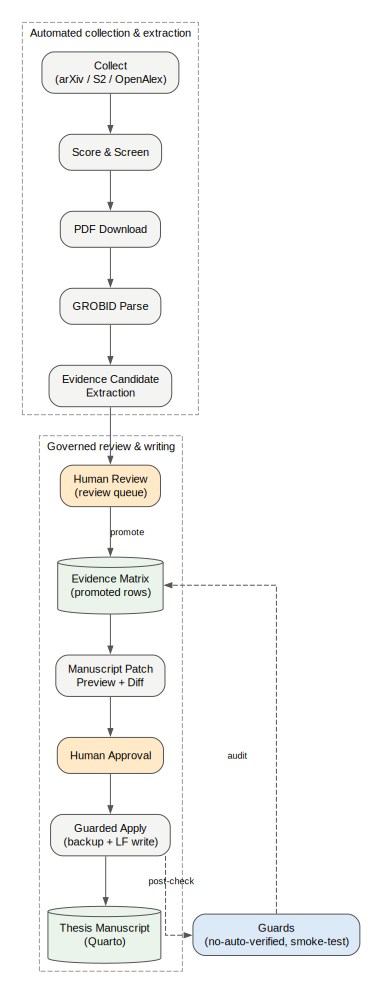
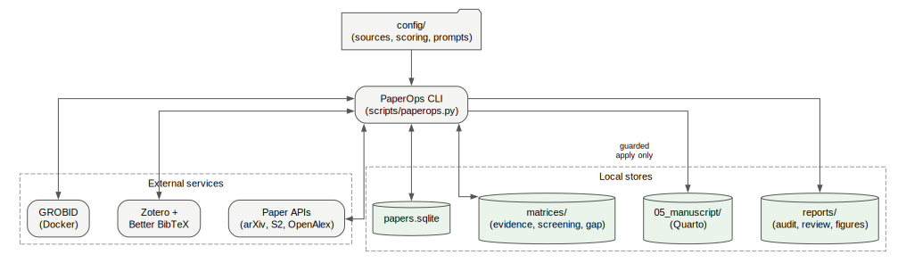
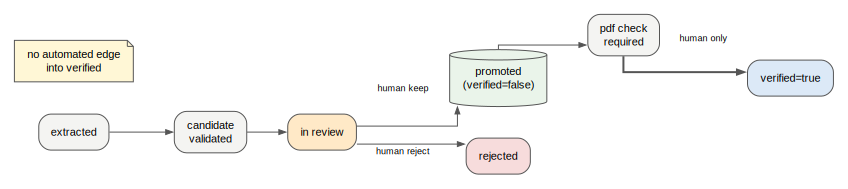
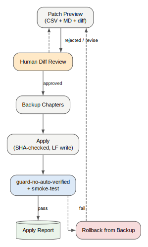

# PaperOps — Evidence-first Research & Thesis Writing OS

**English** | [한국어](README.ko.md) | [中文](README.zh.md) | [日本語](README.ja.md) | [Français](README.fr.md) | [العربية](README.ar.md)



PaperOps automates the **entire research-writing lifecycle** — literature
collection, screening, PDF parsing, evidence extraction, bibliography sync,
guarded manuscript editing, reproducible figure generation, and draft
auditing — through a single local-first CLI with **45+ commands**.

It is *not* an auto-paper-writer. The pipeline is automated, but three
judgment points are deliberately reserved for humans: evidence adoption,
manuscript-change approval, and the `verified=true` decision. Guards make it
impossible for any automated step to fake those.

## The full lifecycle, stage by stage

| Stage | What happens | Key commands | Automation |
|---|---|---|---|
| 1. Collect | Fetch papers from arXiv / Semantic Scholar / OpenAlex with topic profiles | `collect`, `digest` | Automatic |
| 2. Triage | Score relevance, screen by research axes, find research gaps | `score`, `screen`, `gap`, `brief` | Automatic |
| 3. Acquire | Download PDFs, build paper cards and outlines | `download-pdfs`, `cards`, `outline` | Automatic |
| 4. Parse | PDF → structured sections/references via GROBID | `parse-grobid`, `validate-grobid-artifacts` | Automatic |
| 5. Extract | Pull claim/quote/page evidence candidates from parsed text | `extract-evidence-candidates`, `validate-evidence-candidates` | Automatic |
| 6. Review | Decide keep / revise / reject for each candidate | `review-evidence-candidates`, `promotion-plan` | **Human gate** |
| 7. Promote | Move approved evidence into the Evidence Matrix (`verified=false`) | `promote-evidence`, `audit-promoted-evidence` | Guarded |
| 8. Locate | Find and attach exact PDF pages for each quote | `locate-pdf-pages`, `apply-page-metadata` | Guarded |
| 9. Bibliography | Sync citekeys with Zotero / Better BibTeX canonical BibTeX | `sync-zotero`, `check-citekeys` | Automatic |
| 10. Write | Generate manuscript patches as preview + diff | `manuscript-patch-preview` | Automatic |
| 11. Apply | Apply approved patches with backup + SHA check + LF write | `apply-manuscript-patch` | **Human gate** |
| 12. Figures | Spec-driven Graphviz/Mermaid figures, never fabricated data | `propose-figures`, `render-figures`, `apply-figure-placeholder` | Guarded |
| 13. Audit drafts | Check any draft (docx/md/qmd): structure, unsourced claims, overclaims, numbers vs. real experiment outputs | `audit-manuscript-draft` | Automatic |
| 14. Verify | Enforce that no automation ever set `verified=true` | `guard-no-auto-verified`, `guard-paperops-overclaim`, `smoke-test` | Automatic guard / **human verdict** |

## Why this instead of a chat LLM?

| Concern | Typical LLM chat / agent | PaperOps |
|---|---|---|
| Where did this sentence come from? | unknown | `paper_id` + `citekey` + quote + page in the Evidence Matrix |
| Citation correctness | best-effort | `check-citekeys` against canonical BibTeX |
| Manuscript edits | direct overwrite | preview → diff → approval → SHA-checked apply → backup → post-audit |
| "Verified" status | implied | only a human can set it; guards enforce this |
| Numbers in your draft | unchecked | cross-checked against actual experiment output files |
| Reproducibility | session-bound | SQLite + CSV matrices + audit reports + activity log + figure sources |

Design patterns were synthesized from a survey of 40+ open-source research
tools (PaperQA2, STORM, GPT Researcher, AI-Scientist, ASReview, gpt_academic,
Zotero ecosystems, MCP servers — see `docs/03_TOOL_SYNTHESIS.md`), re-assembled
around one principle: **no claim enters the manuscript without traceable,
human-reviewed evidence.**

## Architecture



| Component | Role | Technology |
|---|---|---|
| `scripts/paperops.py` | Orchestrator CLI: all pipeline stages and guards | Python, stdlib-first |
| `scripts/paperops_figures.py` | Spec-driven figure generation (sources always saved) | Graphviz + Mermaid |
| `scripts/paperops_draft_audit.py` | Draft auditing: structure, claims, numeric cross-check | Python |
| `scripts/build_public_release.py` | Whitelist-based public export with secret/PII scan | Python |
| Paper DB | Collected paper metadata, scores, reading states | SQLite |
| Evidence Matrix | claim / quote / page / source location / review status / verification fields | CSV (diff-friendly) |
| Manuscript | Thesis chapters, modified only via guarded apply | Quarto (.qmd) |
| External services | PDF parsing; canonical bibliography | GROBID (Docker), Zotero + Better BibTeX |

Data flows in one direction with audit reports at every guarded step:
**APIs → paper DB → PDFs → parsed text → evidence candidates → (human) →
Evidence Matrix → patch previews → (human) → manuscript**, with guards
(`guard-no-auto-verified`, `smoke-test`) re-run after every change.



## Quickstart

```bash
git clone https://github.com/SakJaeLim/paperops.git && cd paperops
python -m venv .venv
# Windows: .venv\Scripts\activate | Unix: source .venv/bin/activate
pip install -r requirements.txt
python scripts/paperops.py init
python scripts/paperops.py status
```

Works immediately with no external services: collection, scoring, screening,
draft audit, guards, figures-as-source. Optional add-ons:

| Dependency | Enables | Install |
|---|---|---|
| GROBID | PDF → structured text parsing | `docker run -d -p 8070:8070 lfoppiano/grobid:0.8.0` |
| Zotero + Better BibTeX | Canonical bibliography sync | zotero.org + Better BibTeX plugin |
| Graphviz | SVG/PNG figure rendering | graphviz.org/download |

## Typical session

```bash
# Collect and triage
python scripts/paperops.py collect --limit 20
python scripts/paperops.py score && python scripts/paperops.py screen --limit 80

# Parse and extract evidence
python scripts/paperops.py download-pdfs --limit 10
python scripts/paperops.py parse-grobid --paper-id <id> --apply
python scripts/paperops.py extract-evidence-candidates --paper-id <id> --apply

# Human review, then guarded promotion
python scripts/paperops.py review-evidence-candidates --paper-id <id>
python scripts/paperops.py promote-evidence --paper-id <id> --apply

# Guarded manuscript writing
python scripts/paperops.py manuscript-patch-preview
python scripts/paperops.py apply-manuscript-patch --from-preview <preview.csv> --dry-run
python scripts/paperops.py apply-manuscript-patch --from-preview <preview.csv> --apply

# Audit your own draft (docx/md/qmd) — structure, unsourced claims, overclaims
python scripts/paperops.py audit-manuscript-draft --input my_thesis_draft.docx

# Figures and final checks
python scripts/paperops.py render-figures
python scripts/paperops.py guard-no-auto-verified --promoted-only
python scripts/paperops.py smoke-test
```



## Draft audit in practice

`audit-manuscript-draft` was used on a real KCI manuscript (413 paragraphs):
it scanned 378 sentences, checked chapter structure, flagged unsourced strong
claims and overclaim language, and cross-checked **all 178 numeric values**
in the draft against the actual experiment output files — 0 mismatches, with
2 rounding differences explained and 1 base rate re-computed from raw
prediction logs. The audit never edits the draft and never marks anything
verified; it produces a findings report (MD + CSV) for the author.

## Governance rules

1. The Evidence Matrix is never modified casually.
2. `verified=true` is never set automatically — there is no automated
   transition into the verified state.
3. Quote/page matching is *source alignment*, not truth validation.
4. Manuscript edits happen only through guarded preview/apply with backups
   and post-apply guard + smoke-test.
5. Related-work findings are framed as design patterns, never as performance
   evidence for PaperOps itself.

## What this repo does NOT include

Code, configuration, design docs, and generated figure sources only. It
deliberately excludes collected paper PDFs, parsed full texts, evidence
matrices with quotes, and personal manuscript chapters — for copyright
reasons, and because your evidence base should be built from your own
literature. The export is whitelist-based and scanned for secrets/PII before
every release (`scripts/build_public_release.py`).

## Honest limitations

- Evidence extraction is keyword/heuristic-based; an LLM-assisted extractor
  is a planned, separately-guarded step.
- Draft auditing is heuristic flagging for human review, not truth validation.
- Quote/page alignment does not validate the truth of a claim — by design.
- Quantitative result figures are never generated without an actual data file.

## License

MIT — see [LICENSE](LICENSE).
